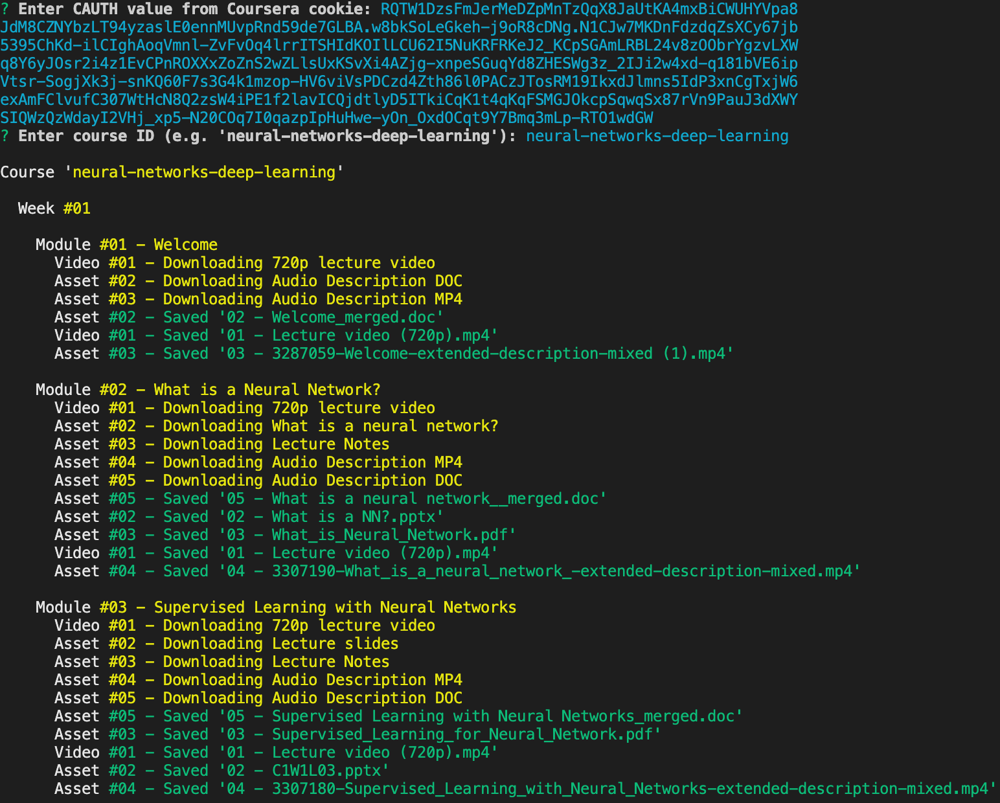
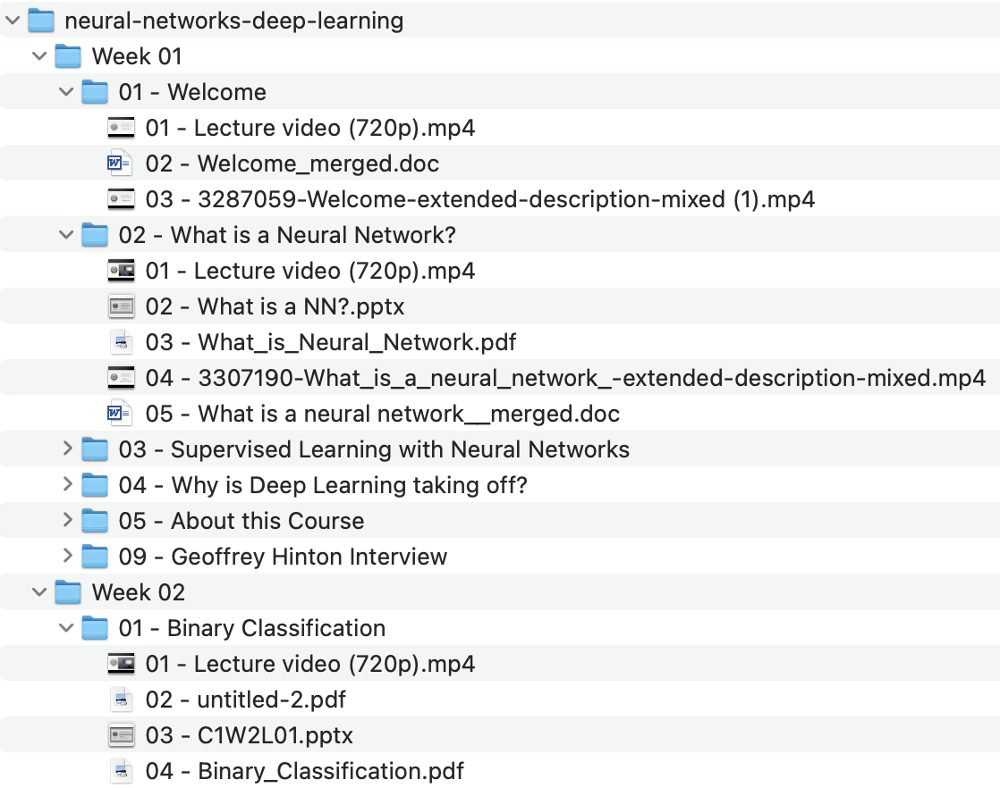

# coursera-scraper


A lightweight Node.js app to fetch assets & videos for Coursera courses.

## Why another Coursera download utility?

As of Jun 2021, the popular `couresera-dl` script is unable to authenticate on the Coursera platform. See this [issue](https://github.com/coursera-dl/coursera-dl/issues/800). This project (`coursera-scraper`) is meant as a quick fix to provide a working solution to the Coursera community and is not meant as a full-fledged replacement of `coursera-dl`.

## What does `coursera-scraper` do?

`coursera-scraper` is lightweight Node.js script (~300 lines), which fetches and downloads lecture assets and videos for a single course, and saves them in a hierarchical directory structure on the local filesystem.

## Prerequisites

-   `git`
-   `node` (v14+)

## Installation

Clone the repo on your local system:

```
git clone https://github.com/dobomode/coursera-scraper.git
```

Then install the packages:

```
cd coursera-scraper
npm install
```

## Usage

Run the script:

```
node index.js
```

### CAUTH value

The script will ask you for the CAUTH value from the Coursera cookie.


To get the CAUTH value:

1. First log into [Coursera.org](https://www.coursera.org/)
2. In your browser, open the Developer Tools and find the CAUTH value from the Coursera cookie. For example in Chrome, you can find this under Developer Tools => Application => Cookies => `https://www.coursera.org`.


3. Copy the CAUTH value to the clipboard and paste it in the terminal where you ran the `coursera-scraper` script:


> Note that you must fetch the CAUTH value after you have logged in successfully on Coursera. If you get an authentication error, most likely this means that your Coursera login and CAUTH values have expired. To fix this, log in again in Coursera and copy the CAUTH value again.

### Course ID

Next, the script will ask you for the ID of the course you would like to scrape:


This part is easy. The course ID is the relevant slug from the course URL. This is typically a dash-separated sequence of lower case words.

For example, the URL of the [Neural Networks and Deep Learning](https://www.coursera.org/learn/neural-networks-deep-learning) course is `https://www.coursera.org/learn/neural-networks-deep-learning`. The slug for the Course ID is the part following `'learn/'`, namely `'neural-networks-deep-learning'`.

Copy the course ID and paste in the `coursera-scraper` terminal:


> Note that the course ID and CAUTH values will stored in a local configuration store, so that if you run the script again, you can reuse the values by simply pressing `<ENTER>`.

### Downloading course assets & videos

At this stage, the script will start fetching and downloading all assets and videos in the course. This might take a few minutes depending on the number and size of the assets.



`coursera-dl` downloads 2 types of files:

1. **Assets** – This includes video transciptions, PPT slides, PDF notes, and any other materials made available by the course authors.

2. **Lecture video** – This is the highest resolution lecture video (720p mp4 format).

### Downloaded files

`coursera-dl` will download all files in a hierarchical directory structure in the working directory of the script. The directory structure is as follows:

`<course id>/<## - week id>/<## - module id>/<## - asset / video>`

For example, on my Mac, the directory structure for the _Neural Networks and Deep Learning_ course looks as follows:



## Notes and limitations

-   Note that this script has not been tested extensively and might not run properly on your system. I have only tested this on my local Mac system. If you run into issues on other configurations, please submit an issue.

-   Simiarly, this script has only been tested on a limited set of courses that I have purchased on Coursera. It is possible that the script does not run properly for other Coursera courses.

-   The script does not download all types of assets. The focus is on downloading the main lecture video and additional assets provided by the authors. Specifically, the following are not downlaoded:

    -   Jupyter notebooks
    -   Non-video lectures (i.e. reading lectures)
